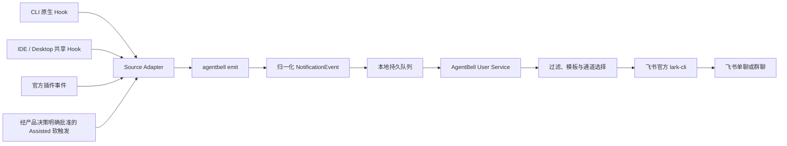

# AgentBell 架构

## 目标与边界

AgentBell 的价值是“跨 Agent 安装器 + 生命周期兼容层 + 通知策略”，不是另一套消息中间件。

- AgentBell Core 必须能在 Windows、macOS、Linux 的常见 x64/arm64 环境运行。
- 同一个事件模型覆盖 CLI、IDE、Desktop App，但每个产品必须标明接入强度。
- 优先使用产品公开的 Hook、插件或共享配置；不注入进程，不篡改应用包，不读取未公开的私有数据库。
- 飞书凭据继续由官方 `lark-cli` 管理，AgentBell 不复制其令牌。

## 目标运行结构

Hook 进程只负责快速入队，目标是在 200ms 内返回。网络发送、重试和模板渲染由用户级后台服务完成，避免 Agent 因飞书网络波动而等待。

## 技术选型

### 产品 Core

正式 Core 已确定使用 Go，不把当前 Node.js 原型直接作为正式运行时：

- 单文件、冷启动快，适合高频 Hook。
- Windows、macOS、Linux 交叉编译和签名流程成熟。
- GUI 应用启动时常拿不到终端里的 Node.js 和 PATH；绝对路径调用原生二进制更可靠。
- 可以把 `agentbell`、`agentbell emit`、`agentbell doctor` 和后台服务放在同一个二进制中。

Node.js 保留为 npm 安装入口和开发期脚手架，例如 `npx @agentbell/cli setup` 下载并校验对应平台的正式二进制。

### 本地服务与队列

- `agentbell emit`：接收 stdin 或命令行事件，完成归一化并写入本地队列。
- `agentbell service`：消费队列、去重、重试并调用传输层。
- 队列：使用无 CGO 的文件系统 spool，包含
  `pending/inflight/history/dead/tmp/keys`，保存事件 ID、租约、重试次数、下次尝试时间
  和最终状态。
- 幂等键：优先使用厂商提供的 idempotency key；否则组合
  `source + surface + runtime + session/task/turn/tool/source id + canonical event`。
  完全无标识时加入原始输入；只有 session 的 Kimi Stop/StopFailure 还加入发生时间，
  避免同一会话后续回合被永久折叠。
- 默认重试：`1s/5s/30s/2m/10m`，达到上限后保留 dead-letter 供 `doctor` 查看。
- 状态迁移先持久化目标再移除来源；启动时修复重复副本并恢复超时租约。

## 跨平台安装

| 平台 | 正式分发 | 用户级服务 | 凭据存储 |
| --- | --- | --- | --- |
| Windows | 签名 MSI / winget / Scoop | 登录启动项或用户级计划任务 | Credential Manager / DPAPI |
| macOS | 签名并公证的 pkg / Homebrew | LaunchAgent | Keychain |
| Linux | install script + deb/rpm/Homebrew | systemd user；无 systemd 时自启动 | Secret Service；不可用时要求显式降级 |

配置遵循平台约定：

- Windows：`%APPDATA%\AgentBell\config.json`
- macOS：`~/Library/Application Support/AgentBell/config.json`
- Linux：`${XDG_CONFIG_HOME:-~/.config}/agentbell/config.json`

Hook 配置必须写入 AgentBell 二进制的绝对路径，不能依赖 GUI 应用继承 shell 的 PATH。
当前本地开发版本在 macOS 使用 LaunchAgent，在 Windows 使用当前用户登录计划任务，
在 Linux 优先使用 systemd user、不可用时回退 XDG Autostart。由于 `lark-cli` 本身
可能通过 `/usr/bin/env node` 启动，配置保存绝对 `larkCliPath`；需要 PATH 的服务定义
会显式包含它的运行目录。

## 运行位置不是操作系统

Windows 用户可能同时存在 Windows Host、WSL、Docker 和 SSH Remote。它们必须被视为不同运行位置：

| 运行位置 | Hook 在哪里执行 | 首期策略 |
| --- | --- | --- |
| 本机 Host | 当前操作系统 | Windows、macOS、Linux GA |
| WSL | Linux 子系统 | 首期 Beta；安装 Linux shim，通过带令牌的本机桥接或独立发送 |
| Docker / Dev Container | 容器内 | 后续阶段；提供 opt-in shim，不自动修改镜像 |
| SSH Remote | 远端机器 | 后续阶段；需要远端 shim + 安全中继 |
| Vendor Cloud Agent | 厂商云端 | 后续阶段；只有厂商公开回调/API 时才支持 |

因此，“Windows/macOS/Linux 全平台”不自动等于“所有 SSH/容器/云任务均可通知”。

## 适配层

每个 Source Adapter 必须提供：

- 安装检测、版本检测和支持能力探测；
- Hook/插件安装计划、dry-run、实际安装和卸载；
- 原始事件到统一事件的映射；
- 平台路径、命令引用和权限处理；
- 可重复执行且不破坏用户已有配置的结构化合并；
- 健康检查与最小端到端测试。

`verify` 只检查安装结构，不能证明宿主已信任或加载 Hook。每次 Hook 成功到达 Core 后，
`emit` 会按规范化事件写入独立的 runtime proof；proof 只含 adapter/event 和时间，
不含原始载荷或 session/task/turn 标识，不同事件并发到达也不会互相覆盖。`diagnose`
只有在适配器要求的关键事件 proof 晚于最后一次 Hook 配置变更时才报告运行态已验证；
Codex 明确要求 `task.completed`，不能由 `approval.required` 代替。

事件映射还要经过“语义真实”门禁。Codex 当前的 `PermissionRequest` 在原生审批路由
之前触发，而 Hook 载荷不能区分人工审核和 `auto_review`；因此缺少明确
`approvals_reviewer=user` 的 Codex 审批事件只留下最小 runtime proof，不进入通知队列。

详细协议见 [适配器协议](./adapter-contract.md)。

## 兼容等级

- A — Verified：有公开、确定性的生命周期事件，并完成三平台或产品支持平台实测。
- B — Pilot：官方声明有 Hook/插件能力，但规范、版本或开放范围仍需验证。
- C — Assisted：只能依赖 Skill/MCP/自然语言约定或厂商原生通知，不能保证每次触发。
- D — Unsupported：没有公开安全入口；AgentBell 不采用日志猜测、UI 注入等高风险方案。

官网与 CLI 输出都必须显示等级，不能把 B/C 包装成“完全兼容”。

## 统一事件

首期规范化事件：

- `task.completed`
- `task.failed`
- `agent.waiting`
- `approval.required`
- `session.interrupted`
- `subagent.completed`（默认关闭）
- `agent.info`（未知事件的保守降级）

当前 Go Adapter 固定生成 `metadata-only` 事件，只发送 Agent、事件、项目显示名和状态。
任务全文、路径、代码、提示词、最后回复和原始 Hook JSON 均不进入队列；配置中的更高隐私
级别仅为协议前向兼容预留，当前不会启用内容采集。

## 安装与卸载安全

- 安装前输出将修改的文件、命令和权限。
- JSON/TOML 使用结构化合并，不覆盖整个配置文件。
- 修改前创建带哈希的备份，写入采用临时文件 + 原子替换。
- Adapter 使用 receipt、标记区域或完整命令指纹确认所有权，卸载时只删除自身配置。
- `agentbell uninstall` 先预检三个 Adapter 与登录服务；npm bootstrap 等 Core 退出后
  只删除当前受管版本目录，默认保留配置、队列与诊断数据。
- 插件安装优先于直接修改用户设置。
- 所有通知 Hook fail-open；AgentBell 故障不得阻塞原 Agent。

## 飞书传输

第一期继续使用官方 `lark-cli`：

- 已安装时复用并检查版本、认证状态和 IM 权限。
- 未安装时由安装器展示来源、版本和命令，经用户确认后安装。
- AgentBell 只保存通道 ID、显示名称和通知策略。
- 后续可以新增企业微信、钉钉和系统通知传输层，不修改 Source Adapter。
