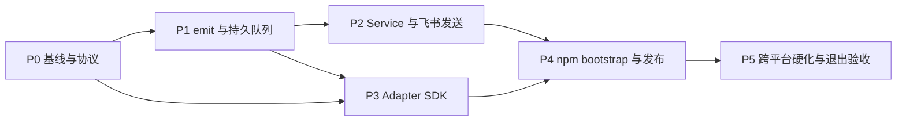

# AgentBell M0.5 执行计划

## 计划状态

| 项目 | 内容 |
| --- | --- |
| 状态 | Implemented；退出验收通过，`v0.2.0-rc.3` Technical Preview 已发布 |
| 基线 | M0 Node.js 协议原型、测试与 CI/CD 已完成 |
| 目标版本 | `v0.2.0` Technical Preview |
| 默认产能假设 | 1 名全职工程师 |
| 估算 | 28–36 个理想工程日，约 6–8 个自然周 |
| 估算不包含 | 采购平台签名证书、厂商等待时间、大规模真实设备采购 |
| 主交付物 | Go Core、持久队列、后台消费进程、Adapter SDK、Codex 垂直切片、Node.js bootstrap、多平台发布产物 |

本计划把 [开发路线](./development.md) 中的 M0.5 拆成可以进入 Issue、Pull Request 和验收的
执行单元。任务编号保持稳定，后续 GitHub Issue 标题应以对应编号开头。

## 一、M0.5 目标

M0.5 要证明 AgentBell 的正式技术骨架可行，而不是完成所有产品适配。阶段结束时，用户应能：

1. 在 Windows、macOS 或 Linux 上获得一个原生 `agentbell` 单文件程序；
2. 通过 `agentbell emit` 在 200ms 目标内把规范化事件可靠写入本地队列；
3. 运行 `agentbell service run` 消费队列，完成去重、重试并调用官方 `lark-cli`；
4. 使用统一 Adapter SDK 检测、规划、安装、验证和卸载 Codex Hook；
5. 通过 npm bootstrap 下载并校验当前平台的 AgentBell Core；
6. 从 GitHub Release 获得六个平台/架构组合的归档、校验和与构建证明。

### 阶段退出条件

以下条件必须全部满足，M0.5 才能标记完成：

- `agentbell emit` 在支持平台的本地磁盘基准中 p95 小于 200ms；
- 命令确认入队后，进程崩溃或服务重启不会静默丢失事件；
- 重复事件只发送一次，失败事件按策略重试并最终进入 dead-letter；
- Codex Adapter 的 `detect -> plan -> install -> verify -> uninstall -> diagnose` 全链路通过；
- 重复安装和重复卸载均幂等，不覆盖用户已有 Hook；
- 默认不持久化 prompt、代码、完整回复或原始 Hook 输入；
- Node bootstrap 能校验 SHA-256，校验失败时绝不执行二进制；
- 六个目标产物能够由干净的 Git 标签可重复构建；
- Linux `go test -race ./...`、三平台单元/集成测试和现有 Node.js CI 全部通过；
- 安装、故障恢复、数据目录、卸载和发布步骤均有文档。

## 二、范围边界

### 本阶段包含

- Go Core 和稳定的内部包边界；
- 统一 NotificationEvent v1 的正式实现；
- 文件系统持久队列、租约恢复、去重、重试、dead-letter 和保留策略；
- 前台可运行的用户级服务进程；
- 官方 `lark-cli` 传输适配；
- Adapter manifest、生命周期接口和安全配置修改工具；
- Codex CLI/Desktop 本地会话作为参考 Adapter；
- npm bootstrap、跨平台构建、checksum、GitHub 构建证明；
- 为 M1 的安装器与更多 Adapter 提供稳定接口。

### 本阶段不包含

- Claude Code、Kimi Code、OpenCode、Qoder 的完整正式 Adapter；
- ZCode、WorkBuddy、TRAE 等 Pilot 的厂商调研；
- Kimi Work 适配；
- GUI 配置程序；
- WSL Host Bridge、SSH、容器或 Vendor Cloud；
- 一次性绑定码、远程 relay、团队管理和企业审计；
- MSI/pkg/deb/rpm 的最终用户安装体验；
- 自动采购或托管 Windows/macOS 代码签名凭据。

M0.5 可以为上述事项定义接口，但不得以占位实现宣称已经交付。

## 三、已冻结的工程决策

### 3.1 运行时与仓库布局

- 初始工具链固定为 Go `1.26.5`，`go.mod` 和 CI 同时固定版本；升级必须单独经过 CI。
- Go 模块放在 `core/`，初始模块路径为
  `github.com/liming0791/agentbell/core`。
- Core 默认 `CGO_ENABLED=0`，确保六个目标可交叉编译。
- 正式运行逻辑进入 Go；Node.js 仅保留 npm 安装入口和开发期兼容原型。
- 外部依赖必须说明理由。事件、队列、重试、checksum 等核心能力优先使用标准库。

Go 工具链版本依据官方 [Go Release History](https://go.dev/doc/devel/release)；版本升级不应
隐式跟随 runner 的 `latest`。

### 3.2 持久队列

M0.5 使用文件系统 spool，不引入需要 CGO 的数据库：

```text
state/
└─ queue/
   ├─ pending/
   ├─ inflight/
   ├─ history/
   ├─ dead/
   └─ tmp/
```

- `emit` 先在同一文件系统的 `tmp/` 写入、刷新并关闭文件，再原子移动到 `pending/`；
- 文件名包含事件 ID 和幂等键哈希，不使用原始项目名、会话内容或 prompt；
- Service 通过原子移动把事件从 `pending/` claim 到 `inflight/`；
- `inflight` 保存租约时间，进程重启后回收超时租约；
- 成功事件进入有上限的 `history`，超过保留期后清除；
- 达到最大重试次数的事件进入 `dead`，由 `doctor` 展示并支持显式重试；
- 队列格式包含独立 `queueVersion`，避免与 NotificationEvent 版本耦合。

若 Windows 实测无法满足原子性、并发或性能门槛，应在 M05-103 内触发决策复审，而不是在
后续阶段悄悄更换存储实现。

### 3.3 服务模型

- M0.5 提供 `agentbell service run --foreground`；
- 使用独占锁文件和心跳租约避免同时启动多个消费者；
- Windows 登录启动项、macOS LaunchAgent、Linux systemd user 的注册属于 M1；
- Hook 不等待网络发送，只等待本地持久入队；
- Hook 集成使用 `--fail-open`，失败时记录最小诊断信息并返回成功，不能阻塞 Agent。

### 3.4 事件与隐私

- 在 `v0.2.0` 前冻结 NotificationEvent v1；
- 统一事件名只使用
  `task.completed`、`task.failed`、`agent.waiting`、`approval.required`、
  `session.interrupted`、`subagent.completed` 和未知事件降级使用的 `agent.info`；
- stdin 原始输入上限为 256 KiB，超出立即拒绝；
- 原始 Hook 输入默认仅在当前进程内用于规范化，不写入队列；
- 队列默认只保存 source、surface、runtime、事件、状态、时间、会话标识哈希和项目显示名；
- summary、cwd 和完整内容必须由用户显式开启相应隐私级别。

### 3.5 发布与签名

- 目标为 Windows `amd64/arm64`、macOS `amd64/arm64`、Linux `amd64/arm64`；
- Windows 使用 `.zip`，macOS/Linux 使用 `.tar.gz`；
- 每次 Release 生成 `checksums.txt` 和 GitHub 构建证明；
- 平台代码签名步骤必须存在显式 gate；缺少证书时产物标记为 Technical Preview，
  不得伪装成已签名；
- npm 发布只发生在 Core 产物、校验和与 smoke test 全部成功之后。

## 四、目标代码结构

```text
agentbell/
├─ core/
│  ├─ cmd/agentbell/          # 单一二进制入口
│  ├─ internal/
│  │  ├─ adapter/             # Adapter SDK、manifest 与注册表
│  │  ├─ app/                 # 子命令编排
│  │  ├─ config/              # 配置、平台路径、校验
│  │  ├─ event/               # NotificationEvent 与规范化
│  │  ├─ queue/               # spool、租约、重试状态
│  │  ├─ service/             # 消费循环与生命周期
│  │  ├─ transport/           # lark-cli command runner
│  │  └─ version/             # 版本和构建信息
│  ├─ testdata/               # 跨 Adapter fixture
│  ├─ go.mod
│  └─ go.sum
├─ packages/
│  ├─ cli/                    # npm bootstrap
│  └─ hook-runtime/           # 迁移期 Node 原型
├─ adapters/                  # 机器可读 Adapter catalog
└─ schemas/                   # 跨语言协议 Schema
```

`internal/` 包不承诺第三方 Go API 稳定性。Adapter 的长期扩展边界是 manifest、命令协议和
fixture，而不是导入 AgentBell 内部 Go 包。

## 五、命令面

M0.5 必须实现并冻结以下命令：

```text
agentbell version [--json]
agentbell emit --adapter <id> --surface <surface> --runtime <runtime> --stdin [--fail-open]
agentbell service run --foreground
agentbell doctor [--json]
agentbell queue list [--state pending|inflight|dead]
agentbell queue retry <event-id>
agentbell adapter detect [<id>] [--json]
agentbell adapter plan <id> [--json]
agentbell adapter install <id> [--dry-run]
agentbell adapter verify <id> [--json]
agentbell adapter uninstall <id> [--dry-run]
```

未实现的命令必须返回明确的 unsupported 错误，不能静默成功。

## 六、依赖关系与关键路径



关键路径为 `P0 -> P1 -> P2 -> P4 -> P5`。P3 可以在事件协议冻结后与 P2 后半段并行。

## 七、执行任务

估算单位为理想工程日，包括编码、自测和 PR 修订，不包括排队等待外部账号或设备。

### P0：工程基线与协议冻结

| ID | 任务 | 产出 | DoD | 依赖 | 估算 |
| --- | --- | --- | --- | --- | --- |
| M05-001 | 决策与接口冻结 | Core、队列、隐私、发布 ADR | ADR 合并；无未决 P0 blocker；模块路径与版本确认 | 无 | 0.5d |
| M05-002 | Go Core 骨架 | `core/go.mod`、命令入口、版本包 | `go test ./...`、`go vet ./...` 通过；`agentbell version --json` 有 commit/version/buildTime | M05-001 | 1.0d |
| M05-003 | Go CI 门禁 | fmt、vet、test、race、六目标 build | PR 自动运行；失败可阻止合并；现有 Node CI 不回退 | M05-002 | 1.0d |
| M05-004 | NotificationEvent v1 | Go struct、JSON Schema、canonical event、golden fixture | Go/Node fixture 双向一致；非法 source/event/time/privacy 被拒绝 | M05-002 | 1.5d |

P0 验收演示：

```bash
cd core
go test ./...
go run ./cmd/agentbell version --json
```

### P1：`emit`、规范化与持久队列

| ID | 任务 | 产出 | DoD | 依赖 | 估算 |
| --- | --- | --- | --- | --- | --- |
| M05-101 | `emit` 命令与输入边界 | flag、stdin reader、256 KiB 限制、错误码 | 空输入、非法 JSON、超限输入、Unicode 和管道关闭均有测试 | M05-004 | 1.0d |
| M05-102 | Adapter 事件规范化注册表 | Codex raw event 到 canonical event 映射 | Stop、failure、permission、waiting、unknown fixture 全部 golden test | M05-004 | 1.5d |
| M05-103 | 文件 spool 队列 | enqueue/claim/ack/nack/recover/dead API | 并发 enqueue 不覆盖；崩溃恢复；损坏文件隔离；目录权限正确 | M05-101 | 2.5d |
| M05-104 | 幂等键与快速返回 | 稳定 key、重复抑制、benchmark | 相同 key 重复 enqueue 只保留一份；三平台 p95 < 200ms | M05-102, M05-103 | 1.0d |

P1 必测故障：

- 写入中进程被终止；
- `tmp` 中残留半文件；
- `pending` 中出现损坏 JSON；
- 磁盘只读或空间不足；
- 两个 Hook 同时发送相同事件；
- 路径包含空格、中文和非 BMP Unicode 字符。

### P2：服务、重试、诊断和飞书传输

| ID | 任务 | 产出 | DoD | 依赖 | 估算 |
| --- | --- | --- | --- | --- | --- |
| M05-201 | 平台路径与配置 | config/state/log 路径、严格校验、权限 | 三平台路径表有单元测试；未知字段策略明确；不复制 lark token | M05-002 | 1.0d |
| M05-202 | Service 消费循环 | 单实例、claim、租约、graceful shutdown | Ctrl+C 不丢事件；陈旧 inflight 自动回收；第二实例拒绝启动 | M05-103, M05-201 | 2.0d |
| M05-203 | `lark-cli` transport | 可注入 command runner、timeout、stderr 截断 | 参数不经 shell 拼接；成功/非零/不存在/超时均有测试 | M05-201 | 1.5d |
| M05-204 | 重试与 dead-letter | `1s/5s/30s/2m/10m` 策略、最大五次 | 可重试与永久错误分类；重启不重置次数；最终状态可查询 | M05-202, M05-203 | 1.5d |
| M05-205 | `doctor` 与 queue 命令 | 机器可读诊断、列出/重试 dead event | 输出不泄露内容；退出码可供脚本判断；人工重试有审计字段 | M05-204 | 1.0d |

端到端测试使用测试目录和 fake `lark-cli` 可执行文件，不调用真实飞书账号：

```text
raw hook -> emit -> pending -> service -> fake lark-cli -> history
```

### P3：Adapter SDK 与 Codex 参考实现

| ID | 任务 | 产出 | DoD | 依赖 | 估算 |
| --- | --- | --- | --- | --- | --- |
| M05-301 | Manifest 与注册表 | Go model、catalog loader、能力校验 | 重复 ID、未知 dialect、非法 phase/support 组合阻止启动 | M05-004 | 1.0d |
| M05-302 | 安全配置事务 | JSON merge、备份、owner receipt、原子替换 | 保留未知字段；冲突停止；失败恢复；只删除自身内容 | M05-301 | 1.5d |
| M05-303 | Codex Adapter 垂直切片 | detect/plan/install/verify/uninstall/diagnose | Windows/macOS/Linux fixture 通过；重复操作幂等；使用 Core 绝对路径 | M05-102, M05-302 | 2.5d |
| M05-304 | Adapter conformance suite | 生命周期共享测试和 fixture harness | 新 Adapter 可复用一组验收；Codex 全部通过 | M05-303 | 1.0d |

M05-303 只把 Codex 升级为“实现完成”。Verified 标签仍要求按适配器协议完成真实产品和三平台
验收，不能仅凭 fixture 自动升级。

### P4：Node bootstrap、多平台产物和发布

| ID | 任务 | 产出 | DoD | 依赖 | 估算 |
| --- | --- | --- | --- | --- | --- |
| M05-401 | 平台解析与下载器 | npm bootstrap、缓存、checksum、原子安装 | 六目标映射；离线、404、校验失败和不支持平台有明确错误 | M05-002 | 1.5d |
| M05-402 | Core Release workflow | 六个归档、checksum、版本注入 | 标签版本与 manifest 一致；干净 runner 可构建；产物名稳定 | M05-003, M05-401 | 1.5d |
| M05-403 | 供应链证明与签名 gate | GitHub build provenance、签名状态 manifest | 每个产物可追溯到 tag/commit；未签名状态机器可读 | M05-402 | 1.0d |
| M05-404 | 安装 smoke test 与 npm 发布顺序 | 临时目录安装、下载、执行、自卸载测试 | Core Release 成功后才允许 npm publish；失败不产生半发布 | M05-401, M05-403 | 1.0d |

发布顺序固定为：

```text
tag 校验
-> Go/Node 全量测试
-> 六目标构建
-> checksum/证明
-> 临时安装 smoke test
-> npm publish
-> GitHub Release 完成
```

### P5：跨平台硬化与退出验收

| ID | 任务 | 产出 | DoD | 依赖 | 估算 |
| --- | --- | --- | --- | --- | --- |
| M05-501 | 故障注入矩阵 | 队列、服务、transport、权限测试 | 下方故障矩阵全部有自动测试或记录的实机测试 | P2, P3 | 2.0d |
| M05-502 | 安装/运维文档 | 数据目录、日志、恢复、卸载、隐私说明 | 新环境按文档可完成 smoke test；无隐式凭据步骤 | P4 | 1.0d |
| M05-503 | RC 与退出评审 | `v0.2.0-rc.3`、验收记录、已知限制 | 所有退出条件有证据链接；P0/P1 blocker 为零 | M05-501, M05-502 | 1.0d |

故障矩阵：

| 场景 | 预期 |
| --- | --- |
| Service 未运行 | `emit` 正常入队，后续启动 Service 能发送 |
| `lark-cli` 不存在 | 事件重试，`doctor` 明确报告 |
| 飞书离线或 timeout | Hook 不阻塞，事件进入退避 |
| Service 在 claim 后崩溃 | 租约过期后事件恢复 |
| 重复 Stop | 只产生一次发送 |
| 配置缺失或 channel 不存在 | 不丢事件，不进行无意义紧密重试 |
| 队列文件损坏 | 隔离并报告，不阻塞其他事件 |
| 用户已有 Hook | 安装后仍保留，卸载后恢复原状 |
| GUI 无 shell PATH | Hook 使用 Core 绝对路径 |
| 默认隐私配置 | 队列与日志无 prompt、代码、完整 cwd |

## 八、质量门禁

### 每个 PR 必须通过

- `gofmt` 无差异；
- `go vet ./...`；
- `go test ./...`；
- Linux `go test -race ./...`；
- 现有 `npm run ci`；
- Schema/fixture 一致性检查；
- 新行为有成功、失败和边界测试；
- `git diff --check`；
- 不引入秘密、token、真实 chat ID 或用户目录 fixture。

### 覆盖率目标

- `event`、`queue`、`adapter` 核心包行覆盖率不低于 80%；
- Go Core 总行覆盖率不低于 75%；
- 关键故障路径不能仅靠覆盖率豁免；
- Node bootstrap 新代码行覆盖率不低于 80%。

### 性能门槛

- `emit` 本地持久入队 p95 < 200ms；
- 单事件输入上限 256 KiB；
- Service 空闲时不进行高频轮询；
- 单个 `lark-cli` 调用默认 15 秒 timeout；
- history/dead 保留有数量或时间上限，磁盘占用不能无限增长。

## 九、计划节奏与 PR 切片

建议保持每个 PR 可独立审查和回滚：

| PR | 主要任务 | 可演示结果 |
| --- | --- | --- |
| PR-1 Core foundation | M05-001～004 | `agentbell version` 和 event golden test |
| PR-2 Durable intake | M05-101～104 | Hook 事件在 200ms 目标内持久入队 |
| PR-3 Delivery service | M05-201～205 | fake lark-cli 端到端发送、重试与诊断 |
| PR-4 Adapter reference | M05-301～304 | Codex 安装/验证/卸载 fixture 闭环 |
| PR-5 Distribution | M05-401～404 | npm bootstrap 下载六目标 RC |
| PR-6 Hardening | M05-501～503 | 故障矩阵、实机记录和 `v0.2.0-rc.3` |

同一 PR 不应同时重构协议、队列和 Adapter 安装逻辑。若某项任务超过三天，应先拆分
接口/fixture PR 和实现 PR。

## 十、GitHub 项目管理

创建 Milestone `M0.5 – Native Core`，并使用以下标签：

- `m0.5`
- `area/core`
- `area/queue`
- `area/adapter`
- `area/release`
- `type/decision`
- `type/feature`
- `type/test`
- `blocked/external`
- `priority/p0`、`priority/p1`、`priority/p2`

每个 Issue 必须包含：

1. 对应任务 ID；
2. 用户或系统结果；
3. 明确范围和非范围；
4. 输入/输出或命令示例；
5. DoD；
6. 测试方法；
7. 依赖 Issue；
8. 跨平台与隐私影响。

优先级：

- P0：关键路径、协议、数据安全、事件丢失；
- P1：M0.5 退出条件；
- P2：可推迟到 M1 且不破坏接口的增强。

## 十一、风险与决策门

| 风险 | 等级 | 应对 | 决策门 |
| --- | --- | --- | --- |
| Windows 文件原子性或杀毒软件影响 spool | 高 | 故障注入、重试 rename、隔离损坏文件 | M05-103 完成前 |
| `lark-cli` 命令或输出变化 | 高 | command runner、版本检测、契约 fixture | M05-203 完成前 |
| 平台签名凭据不可用 | 高 | 技术预览标记、签名 gate、不得假称已签名 | M05-403 开始前 |
| GitHub 用户仓库未来迁移到组织 | 中 | M1 前冻结公开模块路径；内部包不对外承诺 | `v0.2.0` RC 前 |
| Adapter 文档与真实产品不一致 | 高 | fixture 不等于 Verified，保留实机验收门 | M05-303 合并前 |
| 默认日志或队列泄露任务内容 | 高 | metadata-only 默认、隐私测试、日志审查 | 每个 PR |
| npm 包先发布但 Core 产物失败 | 中 | Release 成功后再 publish，重跑幂等 | M05-404 |

任何高风险决策门未通过时，后续依赖任务保持 blocked，不用临时占位逻辑绕过。

## 十二、开始执行时的首批动作

按顺序执行：

1. 创建 GitHub Milestone 和 M05-001～M05-004 Issues；
2. 完成 M05-001，确认模块路径、Go 版本和文件 spool 决策；
3. 从 `main` 创建功能分支，实现 `core/` 骨架；
4. 合入 Go CI 后再实现事件协议；
5. 用最小 Codex Stop fixture 打通
   `raw input -> canonical event -> durable pending file`；
6. 在 Windows 本机先验证 Unicode、并发、杀进程和只读目录场景；
7. P1 通过后再并行启动 Service 与 Adapter SDK。

M0.5 完成后，M1 从服务注册、真实飞书绑定、其余 Verified Adapter 和最终安装体验继续，
不在 M0.5 内扩张范围。
