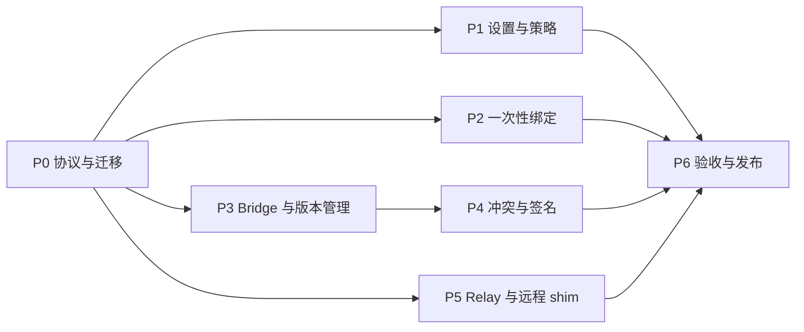

# AgentBell M2 实施计划

## 计划状态

| 项目 | 内容 |
| --- | --- |
| 状态 | In progress |
| 基线 | M1/M1.5 Go Core、七个 Pilot Adapter、持久队列、三平台用户级服务 |
| 目标 | 大众化本机体验、可回滚升级、稳定 Hook bridge、策略路由与显式远程运行面 |
| 数据面 | Go Core；Node.js 继续只做 npm bootstrap |
| 发布等级 | 未完成本计划全部自动和实机门禁前仍为 Technical Preview / Pilot |

M2 不改变 AgentBell 的产品边界：优先使用公开 Hook，不注入 Agent 进程，不读取私有
数据库，飞书凭据继续由官方 `lark-cli` 管理。远程能力是用户显式配置的 shim/relay，
不是新增中心化消息中间件。

### 当前实现进度

当前工作树已有若干可独立验证的纵向基础，但不代表 M2 用户能力已经交付：

- `settings.json` v1 的严格 loader/save、事件开关、模板/免打扰/有序策略数据模型，
  以及 `settings show`、channel rename/default、event enable/disable、template
  CRUD/preview、quiet-hours 和 `policy status/explain` 已进入 Core。Channel
  list/add/rename/remove/default 已统一走带 revision 的原子配置事务，Service 已接入
  首个命中策略、metadata-only 模板、免打扰、逐目标 delivery ledger、部分成功续传和
  per-target retry。自动测试已覆盖并发更新和默认通道约束；三平台真实用户流程仍待验。
- 100-bit 一次性绑定码的本地 store、claim/commit/release、过期租约恢复，以及
  精确纯文本、唯一 chat、时间窗和发送权限验证的 discovery 协议边界已完成。官方
  `lark-cli` Runner、`bind create/complete/status/cancel`、Channel 原子事务和 setup
  的一次性绑定分支均已接通；真实飞书 user/bot 身份与三平台交互验收仍待完成。
- `active.json` v1、受管 Core 路径/checksum 校验、`agentbell-bridge` 的
  `hook-v1`/`service-v1` 分发、Core 内部 bridge 参数和 activation generation runtime
  proof 已完成。Codex/Claude/Kimi Adapter 已具备 bridge receipt、旧自有 Hook 精确迁移
  和 generation-aware diagnose 基础；npm bootstrap 已有受管下载、transaction journal、
  `upgrade`/`rollback`/`versions`、smoke 与失败补偿。App 已从 active state 严格解析
  当前 Core/bridge/generation，三个 Adapter 和三平台 Service 定义均可固定到 stable
  bridge；`service restart`、`bridge doctor` 和首次 `install-core` 初始化 active state
  也已接通。首次 M1→M2 切换由新 Core 执行 `service install`，失败时可由旧 Core
  恢复 legacy 服务定义；后续 rollback 只 restart stable bridge。严格 sidecar/部分
  投递账本回滚 preflight 已完成；macOS 真实 LaunchAgent 已完成备份迁移和后台飞书
  投递，Codex 0.146、Claude Code 2.0.19 和 Kimi Code 也已分别通过新任务/会话取得当前
  generation 的 `task.completed` runtime proof。真实 macOS 已用上一公开 Release 和
  最终 `v0.3.0-rc.4` Draft 完成安装、升级、Hook 字节不变、后台发送、pre-M2 回滚和
  统一卸载；pre-M2 回滚时由 checksum 校验的当前 M2 service Core 保持后台兼容。
  Desktop/IDE Surface、macOS 断网恢复及 Windows/Linux 实机升级/回滚尚未完成，因此
  仍不能把局部实机结果解释为已发布的升级产品流程。
- Hook 冲突审计、只修复 AgentBell 自有条目的 reconcile 命令，以及插件
  manifest/file-set/兼容范围/身份策略校验域已进入 Core。外部 Hook 只报告不删除；
  基于官方 `sigstore-go` 的 exact-artifact、Fulcio/Rekor 与固定 OIDC/repository/workflow
  验证器、`plugin verify` 命令、五个确定性插件包及 Release keyless 签名和下载后复验
  已完成自动测试与工作流接线；真实标签 Release 的产物证据仍待生成。
- RelayEnvelope v1、跨 origin delivery key、Ed25519 exact-body 签名、peer scope、
  nonce store、durable receipt/outbox、queue ingress、HTTPS handler、严格有界 stdio
  frame/ACK 和 outbox forwarder 已完成自动测试；`remote.json`/`relay.json` 严格
  sidecar 模型与存储也已存在。`relay configure/run/bind/peers/receipts`、`remote
  configure/pair/emit/drain`、一次性 peer enrollment、nonce 清理、原生 secret store
  和 WSL/SSH/container/HTTPS connector 执行层均已进入自动测试。独立
  `host-connectors.json` 多 target registry、每 connector 独立 worker/锁/退避/脱敏
  proof，以及 HTTPS durable outbox worker 已接入用户级 service。Host registry 与
  bounded stdio 无监听配对已闭环；断连、ACK 丢失、崩溃恢复和精确去重已有 96 项
  durable stress gate。macOS Host→Linux container stdio 与同 Host 双 Linux container
  TLS/HTTPS E2E 已通过；独立物理主机、公网证书和真实飞书最终到达仍待验。
- Draft PR #4 的 RC4 候选 `aa3ace2` 在 Actions run 30352561499 已完成 13/13 job；
  它证明 M2-603 的跨平台自动门禁保持全绿，不替代 M2-604 的 Windows/Linux/远程实机
  产品验收，也不代表 M2-605 的 manual finalize、npm 与公开 Release 已完成。
- Release workflow 已拆为 `stage`/`finalize` 两次独立执行：Tag push 只留下验证后的
  Draft；维护者必须从同一 Tag 手动 finalize，重新下载复验 Draft 资产并完成 npm
  Trusted Publishing 后，才会把 GitHub Release 转为公开。

## 一、产品结果与完成定义

M2 完成时必须同时证明以下结果。

### 1. 一次性绑定

- CLI 生成高熵、短时有效、单次使用的绑定码；
- 用户把绑定码作为独立消息发送到目标飞书会话；
- AgentBell 通过官方 `lark-cli` 的 user identity 搜索精确消息，解析目标 chat，
  验证所选 user/bot identity 确实可以发送，再原子写入 Channel；
- 绑定码只在创建时显示明文；状态文件仅保存哈希、创建时间、过期时间和消费状态；
- 过期、重复使用、多个会话命中、非精确文本、旧消息重放和无发送权限都必须拒绝；
- 绑定流程不得读取、复制或打印 `lark-cli` token。

### 2. 通知设置与团队策略

- 用户可以管理通道名称、默认通道、事件开关、通知模板和免打扰时间；
- 模板只支持允许列表占位符，不执行脚本，不允许读取 prompt、代码或未启用的隐私字段；
- 免打扰使用显式 IANA 时区和星期/时间段；默认延迟发送而不是丢弃事件；
- 有序策略规则可以按 source、surface、runtime、event、priority 和项目显示名匹配，
  并路由到一个或多个 Channel；
- 多通道发送具有逐通道 delivery ledger，部分成功后重试不得重复发送已成功通道；
- 团队策略仍是本机配置，不在 M2 引入组织后台；M3 才增加企业管理员控制面。

### 3. 安全升级与稳定 Hook

- Codex、Claude Code、Kimi Code Hook 固定调用版本无关的 `agentbell-bridge` 绝对路径；
- bridge 通过原子 active-version 指针调用当前 Core，升级/回滚不修改 Hook 命令，
  不触发 Codex 重新信任；
- 安装器保留 active/previous 版本；新版本完成 checksum、manifest、签名、版本和
  最小 smoke 后才切换；切换或服务重启失败自动回滚；
- `upgrade --dry-run`、`upgrade`、`rollback --dry-run`、`rollback`、`versions`
  提供人类可读与 JSON 输出；
- Adapter 安装前报告重复 AgentBell Hook、旧路径、同事件外部 Hook 和不安全结构，
  只自动修复可证明属于 AgentBell 的条目；
- 插件包必须通过 Sigstore keyless bundle、固定 OIDC issuer/repository/workflow identity
  和文件清单校验；篡改、缺文件、多文件、错误 signer 或降级到未签名包必须失败。

### 4. 跨主机与远程运行面

- relay 协议在 NotificationEvent v1 外增加独立传输 envelope，不把网络字段混入
  Source Adapter 协议；
- 远端 shim 在事件发生处完成规范化和 metadata-only 隐私裁剪，再向 relay 发送；
- envelope 使用 origin id、delivery id、时间戳、nonce 和设备 Ed25519 签名；接收端
  检查 body 上限、时钟偏差、nonce 重放、公钥 scope 和撤销状态；
- relay 将 `origin id + 原幂等键` 重新派生为本机队列幂等键，跨主机、跨重试和跨
  relay hop 不重复发送；
- WSL 默认由 Windows Host 使用 `wsl.exe` 主动拉取 Linux outbox，不开放监听端口；
- SSH 与容器通过用户显式创建的 SSH tunnel 或 TLS endpoint 接入；不扫描主机、
  不自动改镜像、不偷偷开放公网端口；
- Vendor Cloud 只有厂商提供公开 outbound Hook/webhook 时才启用；否则保持 unsupported。

## 二、冻结的架构

### 2.1 稳定入口与版本目录

```text
AgentBell data root/
├─ bin/
│  ├─ bridge/
│  │  └─ v1/agentbell-bridge[.exe]
│  ├─ <version>/agentbell[.exe]
│  ├─ <version>/install.json
│  ├─ active.json
│  └─ transactions/
├─ plugins/
│  └─ <plugin-id>/<version>/
└─ state/
```

`active.json` 只包含 schemaVersion、generation、active/previous 受管版本、目标、
Core checksum、stable bridge checksum、可选 pinned service version/checksum 和
activation transaction id，不接受任意路径。
bridge 按版本和目标推导受管 Core 路径，并拒绝
目录逃逸、symlink/reparse point、缺失 checksum 或不在受管 bin 根内的目标。指针更新
使用临时文件、flush、close、目录同步和原子替换。bridge 只负责：

1. 限制 stdin 为 256 KiB 并读取一个完整 JSON 值；
2. 只接受 `hook-v1` 和 `service-v1` 白名单命令及其固定参数；
3. 读取和验证 active 指针；
4. 使用参数数组和原 stdin 启动 Core，并传入 activation generation；
5. 继承退出码；Hook 模式下保持 fail-open；
6. 不访问网络、不解析飞书配置、不持久化原始 Hook。

Hook 最终固定为：

```text
<stable-bridge> hook-v1 --adapter <id> --surface <surface> --runtime <runtime> --stdin --fail-open
```

Service 也调用 stable bridge 的 `service-v1`，因此 Core 版本切换不需要
重写 LaunchAgent、计划任务或 systemd/XDG 定义。

runtime proof 同时记录 `bridgeProtocol`、`coreVersion` 和 `activationGeneration`。
`diagnose` 必须匹配当前 generation；固定 Hook 文件的旧 proof 不能让新激活 Core
产生运行态已验证的假阳性。

### 2.2 向后兼容的设置 sidecar

M1 的 `config.json` 使用严格未知字段拒绝；直接加入 M2 字段会让回滚后的旧 Core 完全
无法启动。M2 因此保持现有 `config.json` 形状，只继续使用已存在的 larkCliPath、
channels、channel name、defaultChannel 和 legacy event allowlist。新增能力使用独立文件：

```text
<config-dir>/settings.json   # version: 1，模板、明确事件开关、免打扰、策略
<config-dir>/remote.json     # version: 1，远端 outbox/connector 客户端配置
<config-dir>/relay.json      # version: 1，relay peer、公钥、scope 与 listener 配置
<state-dir>/bindings/
<state-dir>/policies/
```

- 缺少 settings/remote/relay sidecar 时保持 M1 行为；
- 每个 sidecar 都有独立版本、`minCoreVersion`、严格未知字段拒绝和原子写入；
- 回滚 preflight 检查 sidecar 的 `minCoreVersion`；旧 Core 不理解且会改变用户可见行为时
  拒绝静默回滚，只有显式导出/降级设置后才允许；
- `config.json` 的 Channel 写操作仍保持 M1 可读；
- 配置写操作使用带 owner token 的 `O_EXCL` 文件锁和 compare-before-write，避免
  setup/service/CLI 并发覆盖；一次性绑定的所有记录状态迁移使用同一条记录锁；
  Windows 锁竞争兼容共享冲突错误，POSIX 继续执行 `0700/0600`，Windows 继承当前
  用户状态根 DACL。

模板允许字段固定为：

```text
sourceName event status project priority occurredAt runtime surface
```

metadata-only 下不得开放 cwd、summary、session/task/turn 或原始 Hook 字段。模板最大
4 KiB，渲染结果最大 16 KiB。

### 2.3 策略与投递账本

策略按配置顺序首个命中；无命中时使用 defaultChannel 和 defaultTemplate。一个策略可以
选择多个 channel id。为保持 M1 rollback 可读，queueVersion 暂时保持 1，只增加旧 Core
会忽略的可选 delivery ledger 字段：

```text
channelId / templateId / state / attempts / nextAttemptAt / lastError / messageId
```

没有 ledger 的旧 item 在 M2 首次 claim 时按当时配置解析一次目标并原子写回；损坏或
无法解析的 item 进入 dead，不得静默丢弃。手工回滚前必须确认没有部分成功的多目标
ledger；自动升级失败发生在新 Service 接管前，因此可以直接恢复 previous。每个投递使用
`sha256(event.idempotencyKey + channelId + templateId)` 作为 `lark-cli` idempotency key。
只有所有目标成功、被策略明确 suppress，或进入逐目标 dead 后，事件 envelope 才进入
history。

免打扰命中时使用 queue `Defer` 更新 `nextAttemptAt`，不增加 attempts。跨午夜、夏令时
切换、时区无效和系统时间回拨必须有测试。`urgent` 默认绕过免打扰；用户可显式关闭。

### 2.4 一次性绑定状态

```text
state/bindings/
├─ pending/<sha256(code)>.json
├─ inflight/<sha256(code)>.json
├─ tmp/
└─ history/<sha256(code)>.json
```

绑定码使用 100 bit 随机值并编码为易输入的 Crockford Base32，显示形式为
`AGB-XXXXX-XXXXX-XXXXX-XXXXX`。默认 TTL 10 分钟，允许范围 2–30 分钟。绑定流程：

1. `agentbell bind create --name <channel> --as <bot|user>`；
2. 用户在目标飞书会话发送仅包含绑定码的消息；
3. `agentbell bind complete --code-stdin` 从隐藏输入读取码，再用
   `lark-cli im +messages-search --as user`
   限定创建时间到过期时间搜索；
4. 只接受唯一 chat 的精确文本命中；
5. 使用目标 identity 发送带幂等键的验证消息；
6. 在同一临界区原子保存 Channel 并把 pending 移到 history。

任何失败都不写 Channel；验证消息成功但本地写入失败时允许使用同一 pending 记录重试，
并复用验证消息幂等键。

### 2.5 Relay v1 与统一 stdio connector

请求：

```text
POST /v1/events
Content-Type: application/json
X-AgentBell-Key-Id: <device-key-id>
X-AgentBell-Timestamp: <RFC3339Nano>
X-AgentBell-Nonce: <32-lowercase-hex>
X-AgentBell-Signature: base64url(Ed25519.Sign(privateKey, signing-material))
```

签名材料固定为
`AGENTBELL-RELAY-SIGNATURE-V1 + method + target/path + RFC3339Nano timestamp + nonce +
sha256(exact-body)`；header 中的 timestamp/nonce 必须与 body 的 `sentAt`/`nonce`
一致，不依赖 JSON canonicalization。

body：

```json
{
  "protocolVersion": "1",
  "teamId": "team-main",
  "origin": {
    "id": "opaque-random-install-id",
    "runtime": "wsl"
  },
  "delivery": {
    "key": "sha256:derived-team-origin-producer-key",
    "producerKey": "sha256:source-event-idempotency-key"
  },
  "sentAt": "RFC3339Nano",
  "nonce": "0123456789abcdef0123456789abcdef",
  "hop": 0,
  "event": {}
}
```

约束：

- body 最大 64 KiB；只接受 NotificationEvent v1；
- 默认允许时钟偏差 5 分钟，nonce 至少保存 10 分钟；
- 远端设备生成 Ed25519 keypair；relay 只保存公钥、origin、team、runtime、source 和
  ingest scope，私钥优先进入 Keychain/DPAPI/Secret Service；
- secret store 不可用时只允许用户明确选择 0600 文件降级并显示警告；
- 日志不输出 secret、签名、原始 body、session/task/turn 或完整 cwd；
- 非 loopback 监听必须提供 TLS cert/key，除非用户显式声明通过 SSH tunnel；
- ACK 只在 receipt 与本机 delivery queue 都持久提交后返回；ACK 丢失后的相同 delivery
  重试返回相同 receipt；
- 最终飞书端仍是 at-least-once；只承诺 relay 边界持久去重，不宣传 exactly-once。

命令面：

```text
agentbell relay configure [--listen <host:port>] [--tls-cert <path> --tls-key <path>]
agentbell relay run --foreground [--listen <host:port>] [--tls-cert <path> --tls-key <path>]
agentbell relay bind create --team <id> --source <source> --runtime <runtime> [--ttl 10m]
agentbell relay peers list
agentbell relay peers revoke <peer-id>
agentbell relay receipts list
agentbell remote configure --team <id> --origin <id> --runtime <runtime> \
  --outbox <path> --connector <https|wsl|ssh|container> ...
agentbell remote pair --code-stdin [--endpoint <url>] [--pinned-spki <sha256>] [--ssh-tunnel]
agentbell remote emit --adapter <id> --surface <surface> --runtime <runtime> --stdin --fail-open
agentbell remote drain --stdio
```

远端 Hook 只写本机 durable outbox，网络和 connector 不进入 Hook 临界路径。WSL 默认
由 Windows Service 运行
`wsl.exe -d <exact-distro> --exec <absolute-agentbell> remote drain --stdio` 主动拉取；
SSH 使用 BatchMode 和系统 host-key 校验执行同一 stdio 协议；Container 由显式
docker/podman exec 或 HTTPS push 接入。三者共享 length-prefixed frame/ACK 协议，不写
三套数据面。Vendor Cloud 只接受厂商公开且可验签的 outbound Hook/webhook。

### 2.6 用户命令面

```text
agentbell bind create --name <channel> --as <bot|user> [--ttl 10m] [--json]
agentbell bind complete --code-stdin [--json]
agentbell bind status|cancel [--json]

agentbell settings show [--effective] [--json]
agentbell settings channel list [--json]
agentbell settings channel add <id> --name <name> --chat-id <id> --as <bot|user> [--dry-run]
agentbell settings channel rename <id> --name <name> [--dry-run]
agentbell settings channel remove <id> [--replacement-default <id>] [--dry-run]
agentbell settings channel default <id> [--dry-run]
agentbell settings event <enable|disable> <event> [--dry-run]
agentbell settings template <list|set|remove|preview> ...
agentbell settings quiet-hours <set|disable> ...
agentbell policy status [--json]
agentbell policy explain --event <event> --source <source> [--at <RFC3339>]

agentbell upgrade [--from <legacy-version>] [--to <version>] [--channel <stable|next>] [--dry-run] [--json]
agentbell rollback [--to <installed-version>] [--dry-run] [--json]
agentbell versions [--json]
agentbell bridge doctor [--json]
agentbell hook conflicts [all|<adapter>] [--json]
agentbell hook reconcile [all|<adapter>] [--dry-run] [--json]
agentbell plugin verify <bundle> [--json]
agentbell relay <configure|run|bind create|peers list|peers revoke|receipts list> ...
agentbell relay connector <add|list|remove|pair> ...
agentbell remote <configure|pair|test|emit|drain> ...
agentbell uninstall [--dry-run] [--json] \
  [--delete-remote-credential --confirm-delete-remote-credential]
```

绑定完成和 relay enrollment 是消费性操作，`--dry-run` 只能检查前置条件，不得消费码。
升级/回滚的下载、验证、staging、active 切换、服务重启和补偿步骤必须写 transaction
journal；npm bootstrap 本地实现恢复命令，不能依赖当前 active Core 仍然可运行。

## 三、任务分解与 TDD 顺序

每个任务严格遵循 red -> green -> refactor：先提交失败测试或 fixture，再写最小实现，
最后重构；没有失败、边界和迁移测试的生产行为不得合入。

### P0：协议、迁移与测试骨架

| ID | 任务 | 主要产出 | DoD |
| --- | --- | --- | --- |
| M2-001 | 冻结本计划和 ADR | 本文、Config/queue/bridge/relay ADR | 约束、威胁模型、命令面和退出证据可审查 |
| M2-002 | 设置 sidecar 与兼容门禁 | versioned settings/remote/relay loader | M1 config 零改形；未知字段拒绝；回滚 preflight |
| M2-003 | 兼容 delivery ledger | queue v1 可选 ledger、Defer/Resolve | M1 可读；部分成功、重复、崩溃和回滚测试 |
| M2-004 | 测试工具 | fake lark-cli、fake clock、relay fixture | Windows/macOS/Linux 路径和参数向量可复用 |

### P1：设置、模板和策略

| ID | 任务 | 主要产出 | DoD |
| --- | --- | --- | --- |
| M2-101 | Channel 设置 | list/add/rename/remove/default | dry-run；默认通道不悬空；并发更新不丢配置 |
| M2-102 | 事件与模板设置 | event enable/disable、template CRUD | 占位符白名单、长度、隐私和注入测试 |
| M2-103 | 免打扰 | timezone/schedule/mode | 跨午夜、DST、urgent bypass、Defer 不增 attempts |
| M2-104 | 团队策略 | ordered matcher、fan-out routing | 多目标部分重试不重发成功目标 |

### P2：一次性绑定

| ID | 任务 | 主要产出 | DoD |
| --- | --- | --- | --- |
| M2-201 | Binding store | create/load/consume/expire | 100 bit 随机、只存哈希、权限、并发单次消费 |
| M2-202 | lark-cli discovery | 精确消息搜索与 chat 解析 | 参数不经 shell；时间窗、唯一命中、输出上限 |
| M2-203 | bind CLI | create/complete/status/cancel | JSON/人类输出；验证发送；失败零配置写入 |
| M2-204 | setup 集成 | setup 可选择绑定码路径 | 原有搜索/建群路径继续兼容 |

### P3：稳定 bridge 与升级回滚

| ID | 任务 | 主要产出 | DoD |
| --- | --- | --- | --- |
| M2-301 | bridge 二进制 | 六目标 `agentbell-bridge` | stdin 边界、路径逃逸、active 损坏、fail-open 测试 |
| M2-302 | 版本指针 | active/previous 原子状态 | 并发读切换、崩溃恢复、checksum 校验 |
| M2-303 | Adapter 迁移 | Codex/Claude/Kimi 固定 bridge 命令 | 现有 Hook 精确迁移；Codex 信任 hash 只变化一次 |
| M2-304 | Service 迁移 | 三平台服务固定 bridge 命令 | 首次 M1→M2 install stable bridge 定义；后续 upgrade 不重写；rollback 可恢复 |
| M2-305 | bootstrap upgrade | install/upgrade/rollback/versions | smoke 失败自动回滚；旧版本保留策略 |

### P4：冲突检测与插件签名

| ID | 任务 | 主要产出 | DoD |
| --- | --- | --- | --- |
| M2-401 | Hook audit | conflict report + repair plan | 外部 Hook 只报告不删除；旧 AgentBell 可自愈 |
| M2-402 | 插件 manifest | 文件清单、key id、版本、兼容范围 | 路径规范化；缺失/额外/重复文件拒绝 |
| M2-403 | Sigstore 验证 | 固定 OIDC issuer/repository/workflow identity | 篡改、错 signer、降级、兼容范围测试 |
| M2-404 | Release 集成 | keyless 签名 plugin bundle/manifest | release smoke 从最终产物安装并验证插件 |

### P5：Relay、跨主机幂等与远程 shim

| ID | 任务 | 主要产出 | DoD |
| --- | --- | --- | --- |
| M2-501 | Relay envelope | 编解码、Ed25519、peer/nonce store | body/skew/replay/撤销/scope 测试 |
| M2-502 | Relay ingress/receipt | stdio + HTTPS durable enqueue | queue+receipt 提交后 ACK；graceful shutdown |
| M2-503 | Remote shim | remote configure/test/emit | 离线退避、本地 spool、metadata-only |
| M2-504 | 跨主机幂等 | origin-scoped key derivation | 两 origin 不碰撞，同 origin/hop/retry 去重 |
| M2-505 | WSL Host Bridge | Windows host-pull + WSL outbox | 无监听端口；路径/重启/断线恢复 |
| M2-506 | SSH/容器/Vendor Cloud | 统一 stdio/HTTPS connector 与 capability gate | 严格 host-key；无官方 Hook 的 cloud 拒绝 |

### P6：产品化验收与发布

| ID | 任务 | 主要产出 | DoD |
| --- | --- | --- | --- |
| M2-601 | doctor/diagnose | config/bridge/version/signature/relay 状态 | JSON 稳定且不泄密 |
| M2-602 | 性能与压力 | emit/bridge/relay/fan-out benchmark | 本地 bridge emit p95 < 200ms；relay 可持续重试 |
| M2-603 | 跨平台 CI | 六目标 Core+bridge、race、迁移矩阵 | Ubuntu/Windows/macOS 全绿 |
| M2-604 | 实机矩阵 | macOS、Windows+WSL、Linux、SSH/container | 安装、升级、回滚、断网、重启、卸载证据 |
| M2-605 | Release | 新 RC、checksum、签名插件、smoke | 完整 Release 成功后才发布 npm |

## 四、依赖关系与并行边界



可以并行：

- Config/策略、bridge/bootstrap、relay 三条实现线；
- 各线拥有独立包和测试文件，避免同时修改 `app.go`、`setup.go` 和文档；
- 主线统一合并 schema、命令分发、migration 顺序和 CI workflow。

禁止并行修改的共享边界：

- NotificationEvent / relay envelope 版本；
- Config 和 queue migration；
- active/previous 指针格式；
- `app.Run` 命令面；
- Release manifest 和签名 key ring。

## 五、CI/CD 与质量门禁

每个实现切片必须通过：

```bash
git diff --check
npm run ci
npm run perf:emit
npm run perf:m2
npm run smoke:https  # Linux / Ubuntu CI
```

新增门禁：

- `go test -race ./...` 覆盖 relay、binding store、config lock 和 delivery ledger；
- 独立 Ubuntu job 用真实 TLS listener、x509 trust、SPKI pin、一次性配对、durable
  ACK、断网恢复和 runtime proof 验证 HTTPS 数据面；
- fuzz：Config v1/v2 migration、模板、relay envelope、Hook conflict parser；
- 六目标构建同时生成 Core 和 bridge；
- bootstrap fault injection：下载中断、checksum/signature 错误、active 切换崩溃、
  service 启动失败、自动回滚失败；
- relay 安全测试：大 body、慢请求、过期 timestamp、nonce replay、撤销 key、
  非 TLS 外部监听；
- 发布 smoke：从最终 Release 安装 Core/bridge/plugin，升级到新版本，再回滚并发送
  fixture 事件；
- Go 总覆盖率继续 ≥75%，`event`/`queue`/`adapter`/`setup` 各 ≥80%；已进入数据面的
  `binding`/`settings`/`relay`/`bridge`/`installstate`/`policy`/`hookaudit`/
  `pluginverify`/`remoteconfig`/`remote`/`secretstore` 包各 ≥80%；后续新增独立数据面
  包时同步纳入门禁。
- npm bootstrap 的 `packages/cli/src/*.mjs` 每个生产模块行覆盖率 ≥80%，新增升级或
  恢复模块必须在加入发布包的同一切片纳入门禁。

## 六、实机验收矩阵

| 场景 | macOS | Windows | Linux | WSL/远程 |
| --- | --- | --- | --- | --- |
| 一次性绑定 user/bot | 必测 | 必测 | 必测 | Host 绑定后复用 |
| 设置/模板/免打扰 | 必测 | 必测 | 必测 | Host policy 生效 |
| Core 升级与自动回滚 | 必测 | 必测 | 必测 | shim 升级独立验证 |
| Codex bridge 信任稳定 | 必测 | 必测 | 必测 | WSL 本地 Codex 另验 |
| Claude/Kimi bridge 新会话 | 必测 | 必测 | 必测 | 按运行位置验 |
| Hook 冲突与精确卸载 | 必测 | 必测 | 必测 | 不越过远端所有权 |
| 插件签名篡改拒绝 | 自动+实机 | 自动+实机 | 自动+实机 | shim 包同样验证 |
| relay 断网/重放/重启 | 自动+实机 | 自动+实机 | 自动+实机 | 必测 |
| SSH tunnel / container | 可作 Host | 可作 Host | 必测 | 必测 |
| Vendor Cloud | 仅公开 Hook 产品 | 仅公开 Hook 产品 | 仅公开 Hook 产品 | 无能力则明确拒绝 |

实机记录必须包含版本、系统、配置摘要、命令、runtime proof、queue/history 状态、飞书
到达结果以及卸载/回滚后的保留结果；不得记录 token、chat id、绑定码或完整任务内容。

## 七、迁移与发布顺序

1. 先发布能读取 M1 config/queue/receipt 的 M2 Core；
2. 安装 stable bridge 和 active 指针，但暂不改 Hook；
3. 逐 Adapter dry-run 并迁移 Codex/Claude/Kimi 自有命令；
4. 迁移 Service 到 bridge；
5. 完成一次真实任务和 `diagnose` 后才清理旧版本路径；
6. 启用 settings sidecar、binding 和 policy；
7. relay 默认关闭，用户显式 enrollment peer/connector 后才启动；
8. 保留 previous Core 和原配置备份，直到新版本完成健康窗口；
9. 卸载先预检远程 shim/peer credential、服务、七个 Adapter 和版本指针；默认保留
   队列、诊断、sidecar/peer 与可恢复配置；私钥必须同时传入
   `--delete-remote-credential` 和 `--confirm-delete-remote-credential` 才可删除。

任何阶段失败都停止后续迁移并保留原工作链路。不得通过修改 Codex 私有 trust state、
删除外部 Hook、关闭签名验证或降低隐私级别来绕过失败。

## 八、M2 退出审计

M2 只有在以下证据全部存在时才完成：

- M2-001～M2-605 全部有实现、测试或实机记录；
- 本计划列出的命令面与文档、help、测试一致；
- Config v1、queue v1 和五个旧 Adapter receipt 都有迁移 fixture；
- Codex/Claude/Kimi 升级前后 Hook 命令字节级不变；
- plugin tamper 和 relay replay 的负向测试真实失败；
- Windows+WSL、macOS、Linux、SSH tunnel/container 至少各有一次端到端记录；
- `npm run ci`、`npm run perf:emit`、race、六目标 Core+bridge build 和 Release smoke
  全绿；
- catalog 等级只按 `docs/adapter-contract.md` 的真实产品矩阵调整，不因 M2 功能完成
  自动升级；
- README、架构、运维、兼容矩阵、决策记录和项目规则与最终代码一致。
